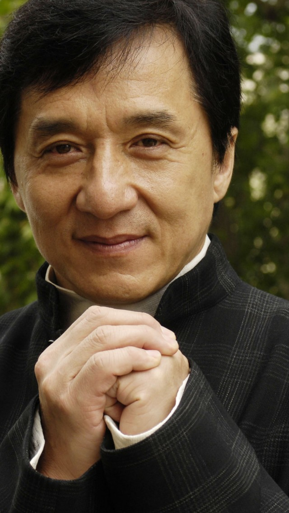
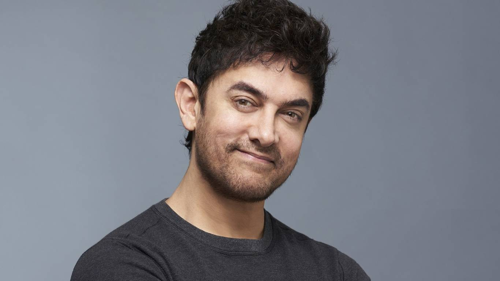

# face_swap

Swapping the face from two images using dlib and opencv


| Source | Destination |
| --- | --- |
| |  | 

| Result |
| --- |
||

## Get started
### Git Clone
```sh
git clone https://github.com/sb-AI-BOT/face_swap.git
```


## Installation
### Requirements
* `pip install -r requirements.txt`

Note: See [requirements.txt](requirements.txt) for more details.


### facial Landmarks
Download the [**shape_predictor_81_face_landmarks**](https://drive.google.com/file/d/1-7AnVEXvKRvatt-B1POjZeITXPnK05vy/view?usp=sharing) model and put it in directory: ```./model/```.


### Swap Your Face
```sh
python face_swap.py --src_img  --dst_img
```
 
